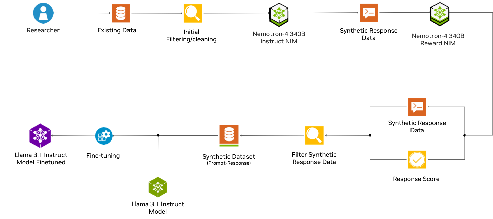

# From Synthetic Data Generation to Model Fine Tuning

This playbook outlines the process of fine-tuning a Llama 3.1 Instruct model, leveraging a synthetically generated dataset produced by the advanced Nemotron-4 340B Instruct system, thereby enabling researchers and developers to enhance the model's performance and tailor its capabilities to specific domains or applications.

The process of fine-tuning a Llama 3.1 model-instruct using a synthetic enriched dataset derived from the *law-stackexchange-questions-answers* and enhanced with Nemotron-4-340B-instruct involves several key steps.

## Data Preparation

First, the original law-stackexchange-questions-answers dataset is obtained from Hugging Face and preprocessed. This dataset contains questions and answers related to legal topics. The data is then split into training, validation, and test sets.

## Synthetic Data Generation
Using Nemotron-4-340B-instruct via NIM, synthetic data is generated to augment the original dataset. The model is prompted to create additional question-answer pairs that mimic the style and content of the law-stackexchange data. This step leverages the large-scale knowledge of Nemotron-4-340B-instruct to create diverse and relevant examples.

## Data Filtering and Quality Control

The generated synthetic data is then passed through the Nemotron 4 340B reward model. This model acts as a quality filter, evaluating the relevance and coherence of the generated question-answer pairs. Low-quality or irrelevant pairs are discarded, ensuring that only high-quality synthetic data is retained.

## Dataset Combination
The filtered synthetic data is combined with the original law-stackexchange dataset. This enriched dataset now contains both real and high-quality synthetic examples, providing a more comprehensive training set for fine-tuning.

## Fine-Tuning Process
The Llama-3.1-model-instruct, specifically the 8B parameter version, is then fine-tuned on this enriched dataset via LORA. The fine-tuning process involves training the model on the combined data, allowing it to learn the specific patterns and knowledge required for legal question-answering tasks.
