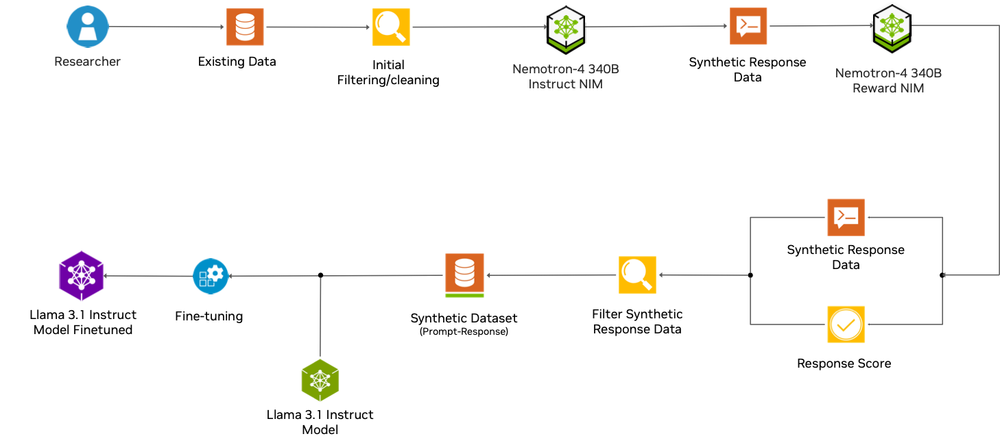

# From Syntetic Data Generation to Model Fine Tuning

This playbook outlines the process of fine-tuning a Llama 3.1 Instruct model, leveraging a synthetically generated dataset produced by the advanced Nemotron-4 340B Instruct system, thereby enabling researchers and developers to enhance the model's performance and tailor its capabilities to specific domains or applications.

